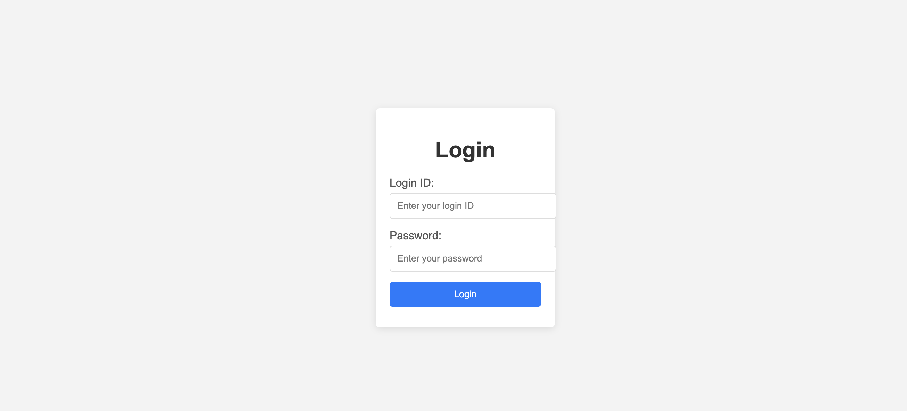
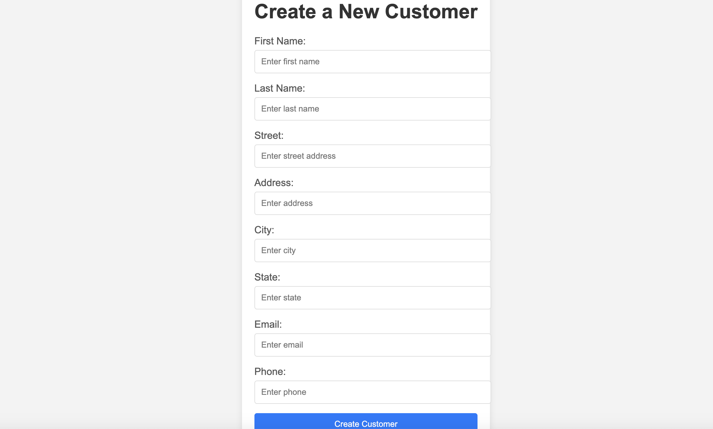
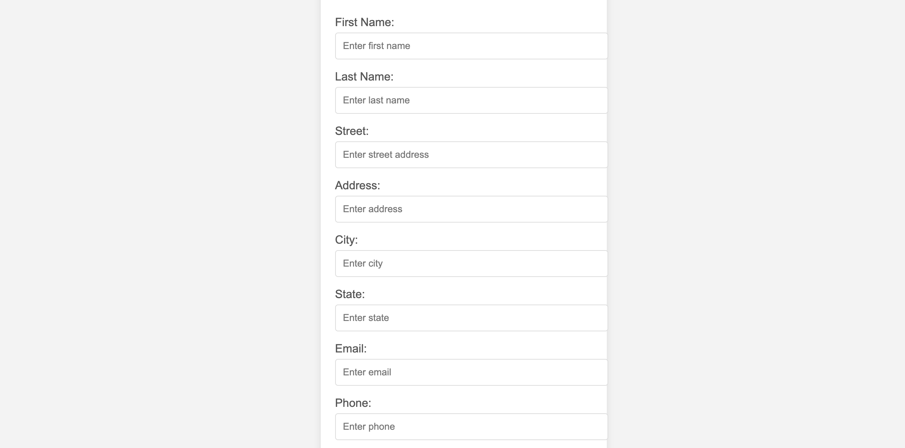

# SunbaseData_Assignment

CRUD application for customer management. This is built using MySQL, Spring Boot, HTML/CSS/JavaScript. It also includes JWT authentication and a sync feature to fetch customer data from an external API.

## Table of Contents

- [Getting Started](#getting-started)
- [Features](#features)
- [Technologies](#technologies)
- [Running the Application](#running-the-application)
- [API Endpoints](#api-endpoints)
- [Screenshot](#screenshot)

## Getting Started

### Prerequisites

- Java 8 or higher
- Maven
- MySQL

### Installation

1. Clone the repository:

    ```bash
    git clone https://github.com/Chetan0777/SunbaseData
    ```

2. Build the project:

    ```bash
    mvn clean install
    ```
3. application.properties
     ```bash
      spring.application.name=SunbaseData

      spring.datasource.url=jdbc:mysql://localhost:3306/sunbase
      spring.datasource.driver-class-name=com.mysql.cj.jdbc.Driver
      spring.datasource.username=root
      spring.datasource.password=chetan123
      
      spring.jpa.hibernate.ddl-auto=update

     ```
4. Set Properties:
  ```bash

      Change database name and  username & password
  ```

## Features

- View list of customers
- Add new customer
- Update customer
- Delete customer
- Search customers
- Sync customer

### Technologies
- Java
- Spring Boot
- Spring Data JPA
- Hibernate
- Lombok
- HTML/CSS/JavaScript
- JWT Authentication

## Running the Application

1. Run the application:

    ```bash
    mvn spring-boot:run
    ```

2. The application will start on port 8080. You can access the API at `http://localhost:8888/`

## API Endpoints

- /login - login in the application
- /customers - View list of customers
- /customer/new - Add new customer
- /customer/update/{id} - Update customer
- /customer/delete/{id} - Delete customer

## Screenshot

#### Login


#### Create


#### Update

